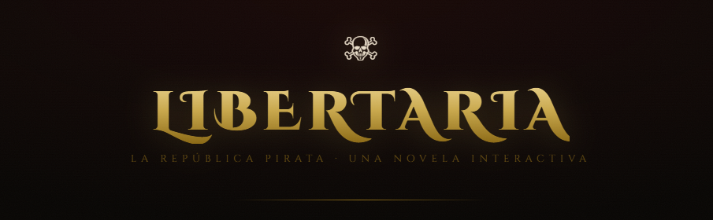

# LIBERTARIA – La República Pirata . Novela Interactiva Web (En desarrollo) 
<p align="center">
  
</p>

**LIBERTARIA – La República Pirata** es una novela interactiva en formato web, donde las decisiones del lector influyen directamente en el desarrollo de la historia y conducen a diferentes finales.

El proyecto combina narrativa, elección y exploración para ofrecer una experiencia ambientada en una república pirata ficticia.

---

## 🏴 Características

- Novela interactiva basada en decisiones
- Enfoque narrativo y experimental

---

## 🌐 Tecnologías utilizadas

- HTML
- CSS
- JavaScript

*(No requiere backend ni base de datos)*

---

## 🚀 Cómo usar el proyecto

1. Clona el repositorio:
   ```bash
   git clone https://github.com/tu-usuario/libertaria-la-republica-pirata.git

2. Abre el archivo principal en tu navegador:
   ```
   index.html
   ```

